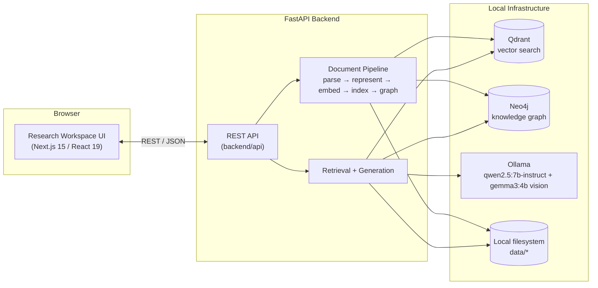
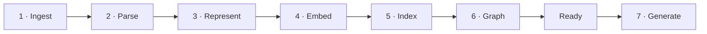

<div align="center">

# Knowledge-Infused Multimodal RAG

**Research Workspace** — evidence-grounded question answering over scientific PDFs, with retrieval fused across text, tables, figures, and a citation graph.

[](LICENSE)

</div>

---

## Highlights

- Evidence-grounded question answering over scientific PDFs
- Multimodal retrieval across text, tables, and figures
- Citation-backed responses with synchronized PDF navigation
- Knowledge-graph-expanded retrieval, not just nearest-neighbor search
- Local-first architecture using open-source models — no paid APIs
- Modern full-stack application with FastAPI + Next.js

## Overview

**Knowledge-Infused Multimodal RAG** (shown to end users as **Research Workspace**) is a full-stack application for asking questions about scientific papers and getting answers you can actually verify.

Upload a PDF. The system parses it into text, tables, and figures; builds a graph of how those pieces relate to one another (citations, references, section continuations); embeds and indexes everything; and answers questions using only what the paper actually says — with every claim traceable back to a specific sentence, table, or figure, at a specific page and location in the original document.

Every stage runs against real infrastructure — Qdrant, Neo4j, and a local Ollama model — with no mocking, and is covered by over 100 automated tests, including full pipeline integration tests and a retrieval/generation benchmark suite.

## Motivation

General-purpose LLMs are fluent, but not naturally honest about scientific documents: they will answer from prior training data instead of the paper in front of them, they routinely ignore tables and figures in favor of surrounding text, and they rarely show *where* in the document a claim actually came from.

This project exists to address three specific problems:

1. **Trustworthy answers.** Every sentence that states a fact is required to carry a citation back to a specific knowledge unit — a paragraph, a table, or a figure — that a reader can verify immediately, in the original PDF.
2. **Figures and tables as first-class evidence.** Tables keep their row/column structure through parsing instead of being flattened into prose, and figures are analyzed by a vision model when a question is actually about them.
3. **Retrieval beyond a single similarity score.** Scientific papers are structured documents — sections continue, works cite each other, references get reused. Backing vector search with a real graph traversal surfaces evidence that nearest-neighbor search alone would miss.

## Key Features

- **Evidence-grounded answers** — the model answers only from retrieved evidence, never outside knowledge, and every factual sentence must carry a citation.
- **Multimodal retrieval** — text, tables, and figures are all first-class citizens in the index, not text-only with images bolted on.
- **Knowledge-graph-backed retrieval** — vector search is expanded through a citation/reference graph in Neo4j, surfacing cited references and continuing sections that pure top-K search would miss.
- **Hybrid ranking** — Reciprocal Rank Fusion over four independent signals (dense similarity, lexical overlap, graph proximity, relationship confidence).
- **Clickable citations with exact PDF navigation** — click a citation and the PDF viewer jumps to the exact page and highlights the exact region it came from.
- **On-demand visual reasoning** — figure-specific questions trigger a local vision-language model to describe what's actually visible in the figure image, layered on top of its caption.
- **Per-document conversation history** — every uploaded paper keeps its own independent conversation thread.
- **Full generation traceability** — every answer carries a phase-by-phase trace (planning, retrieval, grounding, citation resolution).
- **A real evaluation harness** — retrieval metrics (recall, precision, MRR, nDCG, hit rate), generation metrics (citation accuracy, grounding accuracy, unsupported-claim rate), and operational metrics (latency, throughput, CPU, memory), run against a real benchmark dataset.
- **Local-first by design** — parsing, embedding, and generation all run locally; a document never has to leave the user's machine to be processed.

## Architecture Overview

The application is two independently deployable services plus a small set of local infrastructure:



- **Frontend** (`frontend/`) — a Next.js 15 / React 19 research workspace: a document sidebar, a conversation panel, an evidence panel, and a PDF viewer, kept in sync by a small set of Zustand stores and TanStack Query.
- **Backend** (`backend/`) — a FastAPI service structured as one vertical package per pipeline stage (ingestion, parsing, chunking, embeddings, search, graph, retrieval, generation, evaluation), each following the same internal shape: `interfaces/` (ports) → `providers/` (the only place a vendor SDK is imported) → `services/` (orchestration) → `repository/` (per-stage storage) → `validator/` (structural checks at every phase boundary).
- **Infrastructure** — Qdrant and Neo4j run in Docker; Ollama runs natively on the host and serves both the text generation model and the vision model used for figure analysis.

The complete technical breakdown — full data flow, backend and frontend internals, every pipeline stage, storage layout, and error handling — along with the engineering reasoning behind each major technology choice, lives in the [Documentation](#documentation) section below.

## Repository Structure

```
knowledge-infused-multimodal-rag/
├── backend/                     FastAPI service — one vertical package per pipeline stage
│   ├── api/                     routes, request/response schemas, DI wiring (app.py, dependencies.py)
│   ├── domain/                  vendor-independent entities: Chunk, Paper, Relationship, BoundingBox...
│   ├── ingestion/                upload handling, raw PDF storage
│   ├── parser/                   Docling-backed parsing → structured Paper (text, tables, figures)
│   ├── chunking/                 Paper → Knowledge Units ("Chunk"s) + relationships
│   ├── embeddings/                Knowledge Units → vector embeddings
│   ├── search/                    embeddings → Qdrant index
│   ├── graph/                     Knowledge Units → Neo4j knowledge graph
│   ├── retrieval/                 question → ranked, graph-expanded evidence bundle
│   ├── generation/                evidence bundle → grounded, cited answer (via Ollama)
│   ├── evaluation/                real benchmark suite (retrieval + generation + ops metrics)
│   └── storage/                   shared local-filesystem storage abstraction
├── frontend/                    Next.js 15 "Research Workspace" UI
│   ├── app/                       App Router pages (landing, workspace/[documentId], settings)
│   ├── components/                 conversation, evidence, pdf, navigation, workspace, ui (shadcn)
│   ├── store/                      Zustand: conversation, document library, workspace, accessibility
│   ├── services/                   API client + TanStack Query hooks
│   ├── hooks/, types/, utils/, constants/, lib/, providers/
│   └── tests/                      unit, component, hooks, integration, e2e
├── data/                         per-document pipeline artifacts (raw → parsed → knowledge → embeddings → index → graph → retrieval → generation)
├── docs/                         architecture documentation
├── tests/                        backend pytest suite
├── docker-compose.yml            Qdrant + Neo4j
└── pyproject.toml                backend package + tooling config
```

## End-to-End Pipeline

Uploading a paper runs it through a seven-stage backend pipeline before it's ready for questions:



| Stage | Endpoint | Purpose |
|---|---|---|
| 1. Ingest | `POST /documents` | Validate and store the uploaded PDF. |
| 2. Parse | `POST /documents/{id}/parse` | Extract text, tables, and figures, each with page-level positions. |
| 3. Represent | `POST /documents/{id}/represent` | Split the parsed paper into citable **Knowledge Units**. |
| 4. Embed | `POST /documents/{id}/embed` | Generate a vector embedding for every Knowledge Unit. |
| 5. Index | `POST /documents/{id}/index` | Store embeddings in a per-document vector index (Qdrant). |
| 6. Graph | `POST /documents/{id}/graph` | Build a citation/reference graph connecting Knowledge Units (Neo4j). |
| 7. Generate | `POST /documents/{id}/generate` | Retrieve relevant evidence and generate a grounded, cited answer. |

Retrieval combines vector search with graph traversal and rank fusion; generation runs entirely against retrieved evidence and verifies every citation before it reaches the client. The full mechanics of each stage — including the Knowledge Unit model, the retrieval algorithm, figure/table handling, the citation-resolution pipeline, and conversation memory — are in [`docs/ARCHITECTURE.md`](docs/ARCHITECTURE.md).

## Example Usage Workflow

A typical session, end to end:

1. **Upload** a PDF from the landing page. It appears in the sidebar immediately with a "Preparing" status while the backend runs it through the seven-stage pipeline.
2. **Wait** for the status to change to "Ready" — this covers parsing, Knowledge Unit extraction, embedding, indexing, and graph construction.
3. **Ask a general question**, e.g. *"What is this paper about?"* — the answer arrives with inline citations like `(Section: I. Introduction)`.
4. **Click a citation** in the answer. The right-hand panel switches to the PDF tab and jumps directly to the page and highlighted region the citation came from.
5. **Ask about a figure specifically**, e.g. *"Explain Figure 1 in detail."* — this triggers on-demand vision analysis of the actual figure image, not just its caption.
6. **Ask a follow-up**, e.g. *"What did you just say about Figure 2 specifically?"* — the conversation panel retains context for this document, so the question doesn't need to restate what it's referring to.
7. **Upload a second paper** and switch between the two in the sidebar. Each document keeps its own independent conversation history, PDF view, and evidence panel.

## Limitations

- **Figures are retrieved by caption text only.** There is no dedicated image embedding model yet, so a figure with a sparse caption can be harder to retrieve on visual similarity alone — vision analysis only kicks in once a figure-centric question has already surfaced it.
- **Conversation context is not sent to the backend.** Each question is answered independently; the model does not see prior turns, so pronoun-heavy or highly ambiguous follow-up questions can occasionally be misinterpreted.
- **Retrieval and the knowledge graph are scoped per document.** There is no cross-document search — each uploaded paper has its own isolated Qdrant collection and graph.
- **No continuous integration pipeline.** The test suite (95 backend files, 12 frontend files) currently runs locally only.

## Future Work

- Add a dedicated image embedding model so figures can be matched on visual similarity, not just caption text.
- Support cross-document retrieval and citation for users working across a whole library of papers.
- Introduce server-side conversation context so follow-up questions can resolve references across turns.
- Wire the existing test suite into a CI pipeline.

## Getting Started

This project is **local-first**: parsing, embedding, retrieval, and answer generation all run on your own machine, using a local Ollama model rather than a hosted API. See [Deployment](#deployment) for why.

### Prerequisites

| Requirement | Version | Notes |
|---|---|---|
| Python | **3.12** (not 3.13+, not 3.11) | `pyproject.toml` pins `>=3.12,<3.13` |
| Node.js | 20+ | with npm |
| Git | any recent version | to clone the repository |
| Docker | any recent version | runs Qdrant + Neo4j |
| [Ollama](https://ollama.com) | any recent version | runs the local LLM and vision model |

### Installation

**1. Clone the repository**

```bash
git clone https://github.com/nocapgaurav/knowledge-infused-multimodal-rag.git
cd knowledge-infused-multimodal-rag
```

**2. Backend setup**

```bash
python3.12 -m venv .venv
source .venv/bin/activate
pip install -e ".[dev]"
deactivate
```

**3. Frontend setup**

```bash
cd frontend
npm install
cd ..
```

**4. Environment variables (optional)**

Both halves read configuration from environment variables, with working defaults for local development — copying these files is only needed if you want to change something:

```bash
cp .env.example .env                       # backend: host/port, Qdrant/Neo4j/Ollama URLs, CORS
cp frontend/.env.example frontend/.env.local  # frontend: NEXT_PUBLIC_API_BASE_URL
```

### Ollama Setup

```bash
# Install Ollama — see https://ollama.com/download for your platform

# Start the Ollama service (skip if it's already running as a background service)
ollama serve

# Pull the models this project uses
ollama pull qwen2.5:7b-instruct   # text generation
ollama pull gemma3:4b             # figure vision

# Verify both models are available
ollama list
curl http://localhost:11434/api/tags
```

### Running the Project

Each of the following runs in its own terminal.

**1. Infrastructure — Qdrant + Neo4j**

```bash
docker compose up -d
```

**2. Ollama** (if not already running as a service)

```bash
ollama serve
# → http://localhost:11434
```

**3. Backend**

```bash
source .venv/bin/activate
uvicorn backend.api.app:create_app --factory --host 127.0.0.1 --port 8000
# → http://localhost:8000
# → http://localhost:8000/docs   (interactive OpenAPI docs)
```

**4. Frontend**

```bash
cd frontend
npm run dev
# → http://localhost:3000
```

Open **http://localhost:3000**. The status indicator in the footer should read **"Backend connected."**

```bash
# Sanity-check the backend directly
curl http://localhost:8000/health     # {"status":"ok"}
```

<details>
<summary><strong>Troubleshooting</strong></summary>

<br>

**Frontend shows "Backend unavailable" / uploads fail with "Could not reach the server."**
1. Confirm the backend process is actually running and healthy: `curl http://localhost:8000/health`.
2. If that fails, the backend isn't running. The most common cause is an incompatible or missing Python environment: `which uvicorn` should point inside `.venv/bin/`.
3. If `curl` succeeds but the browser still can't reach it, check the browser console for a CORS error and confirm `cors_allowed_origins` in `backend/config/settings.py` includes the frontend's actual origin.

**`pip install -e ".[dev]"` fails or `ModuleNotFoundError` on startup.**
Check `python --version` inside the activated venv — it must be 3.12.x.

**Uploads succeed but questions never get answered.**
Confirm Ollama is running and has the configured models pulled: `curl http://localhost:11434/api/tags`.

</details>

## Deployment

This project is intentionally **not deployed publicly**, and that is a design decision, not a limitation.

Research Workspace performs multimodal retrieval and answer generation entirely with local models — a local embedding model, a local vector database, a local knowledge graph, and a local LLM served through Ollama. That architecture is what makes three things possible at once:

- **Privacy** — an uploaded paper, and everything derived from it (embeddings, graph, generated answers), never leaves the machine it was processed on.
- **Reproducibility** — every result comes from a fixed, versioned local model rather than a hosted API that can change behavior without notice.
- **Zero API cost** — there is no third-party inference bill; the only requirement is the compute to run Ollama locally.

Running the system therefore means running it on your own machine, following the [Getting Started](#getting-started) section above — there is no hosted demo, because the entire point of the design is that inference happens locally, not against a remote service.

**This is a starting point, not a ceiling.** Every external dependency — the generation model, the embedding model, the vector store, the graph store — sits behind its own interface (`backend/*/interfaces/`), with exactly one file per dependency (`providers/`) allowed to know which concrete implementation is in use. Moving to hosted infrastructure is therefore a matter of implementing that same interface against a different provider, not a rewrite of the retrieval, citation, or generation logic:

- **Generation** — swap `OllamaProvider` for an equivalent provider backed by OpenAI, Anthropic, Azure OpenAI, or Amazon Bedrock, or for a self-hosted inference server such as vLLM, TGI, or Triton.
- **Embeddings** — swap the local `sentence-transformers` provider for a hosted embedding API.
- **Vector search / knowledge graph** — swap the local Qdrant/Neo4j containers for managed equivalents (e.g. Qdrant Cloud, Neo4j Aura).

Local-first is the default because it best serves this project's actual goals — privacy, reproducibility, and zero marginal inference cost — not because the architecture is limited to it.

## Documentation

This README is intentionally a high-level overview. For a deeper technical dive:

- **[`docs/ARCHITECTURE.md`](docs/ARCHITECTURE.md)** — the complete system architecture: full data flow, backend and frontend internals, every pipeline stage (parsing, Knowledge Units, embeddings, retrieval, generation, citations, conversation memory), storage layout, and error handling, with diagrams throughout.
- **[`docs/SYSTEM_DESIGN.md`](docs/SYSTEM_DESIGN.md)** — the engineering reasoning behind these choices: why each major technology was selected, the trade-offs accepted, and the alternatives considered.

## License

Licensed under the [MIT License](LICENSE).
