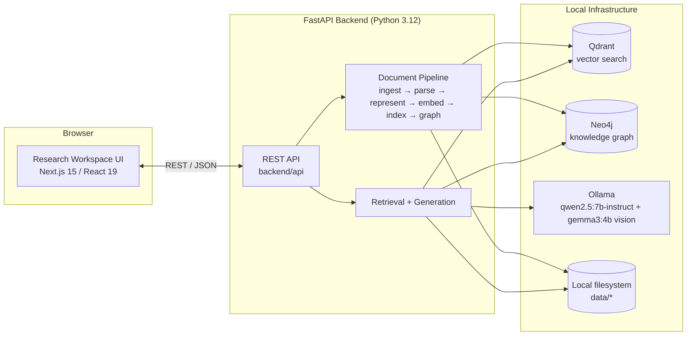
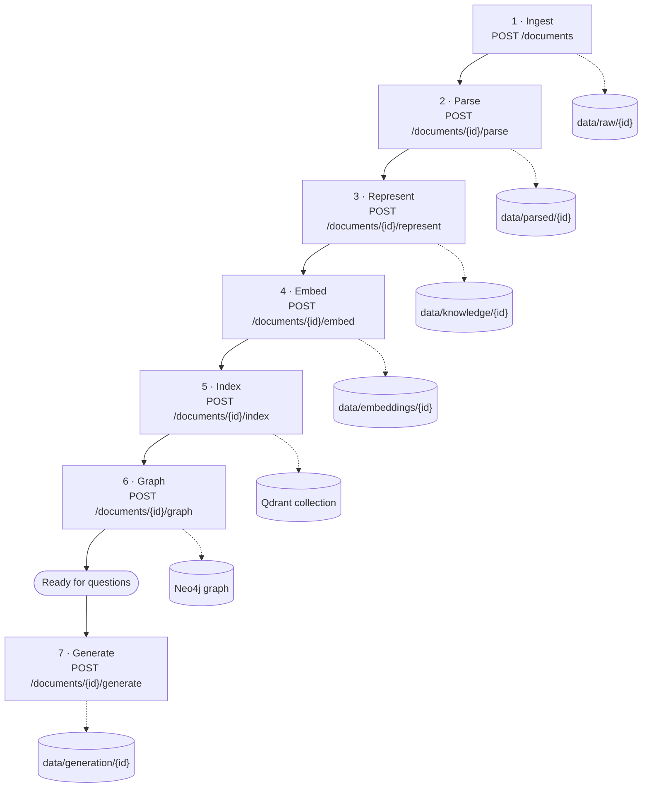
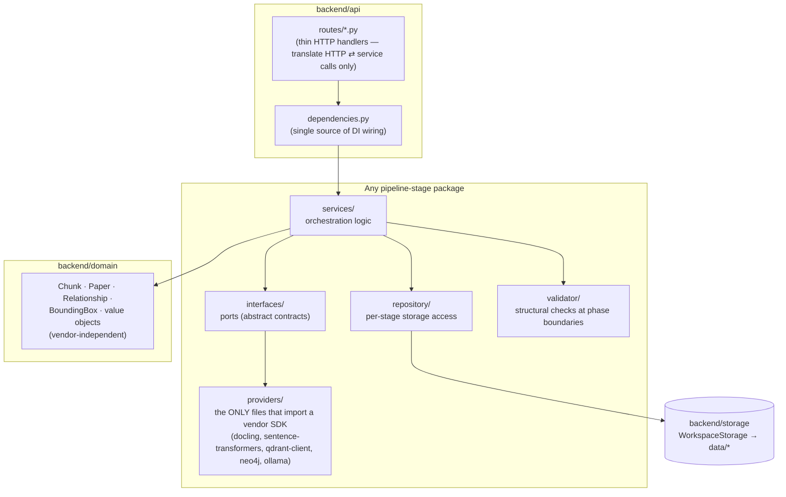
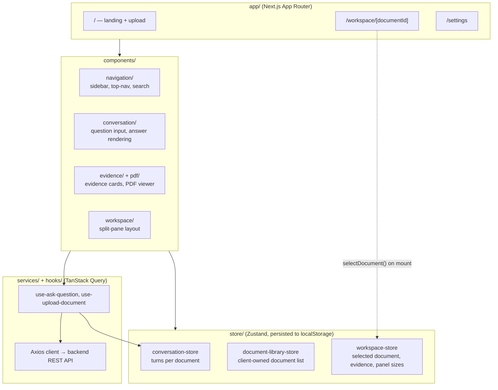
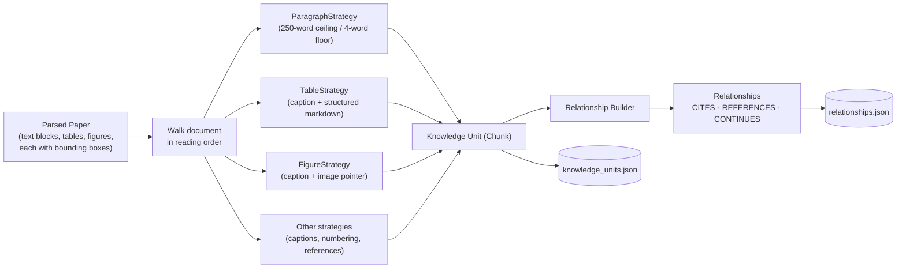
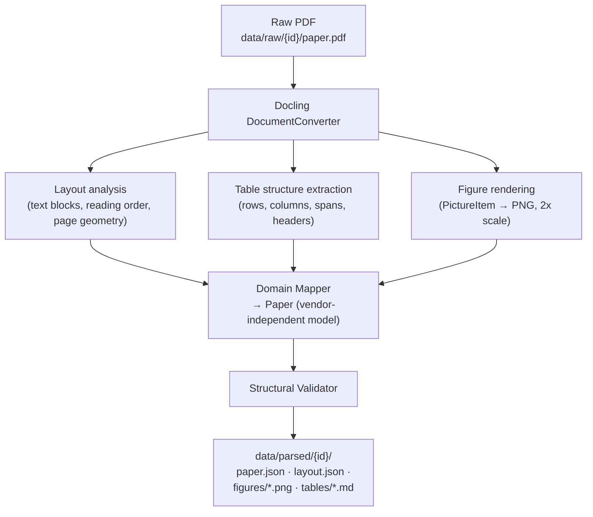
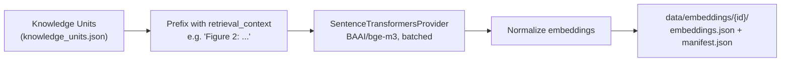
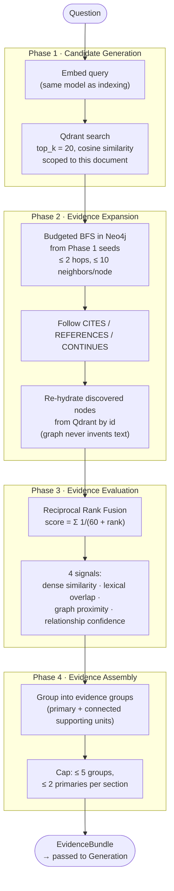
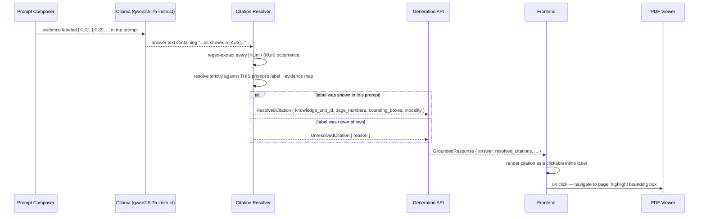
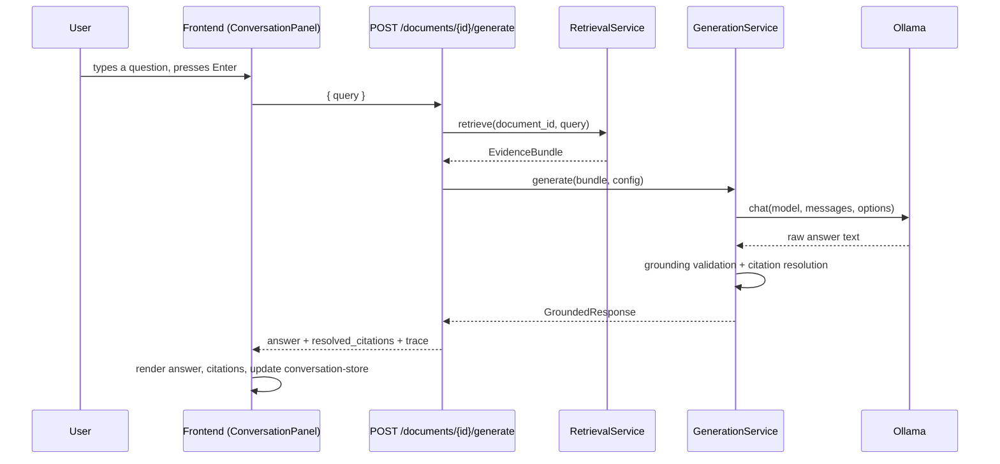

# Architecture

A technical description of how Research Workspace is built: the complete data flow from an uploaded PDF to a cited answer, the internal structure of the backend and frontend, and the mechanics of every pipeline stage. For *why* these choices were made, including why each major technology was selected, see [`SYSTEM_DESIGN.md`](SYSTEM_DESIGN.md).

---

## 1. High-Level Architecture

The application is two independently deployable services plus a small set of local infrastructure:



Two names are used deliberately throughout this project: **Knowledge-Infused Multimodal RAG** is the repository/package name (used in `pyproject.toml`, backend `app_name`, OpenAPI metadata); **Research Workspace** is the name shown inside the running application (`frontend/app/layout.tsx`, the top navigation bar). Both refer to the same system.

## 2. Complete Data Flow

An uploaded document moves through seven backend stages before it can be questioned, then every question runs through a further two-service pipeline (retrieval, then generation):



Each stage is a separate REST call, each is independently idempotent (safe to re-run), and each persists a manifest describing exactly what it produced — this is what makes the pipeline debuggable stage-by-stage rather than an opaque "upload and wait" black box.

## 3. Backend Architecture

The backend is organized as one vertical package per pipeline stage — `parser`, `chunking`, `embeddings`, `search`, `graph`, `retrieval`, `generation`, `evaluation` — and every one of those packages follows the same internal layering:



The rule this enforces: **only the `providers/` layer of a package is allowed to import the concrete vendor SDK.** Only `docling_parser.py` imports `docling`; only `sentence_transformers_provider.py` imports `sentence_transformers`; only `qdrant_provider.py` / `qdrant_retriever.py` import `qdrant_client`; only `neo4j_provider.py` / `neo4j_retriever.py` import `neo4j`; only `ollama_provider.py` imports `ollama`. Every other file talks to an `interfaces/` port instead. This is what lets, for example, `retrieval_service.py` be tested without a running Qdrant instance — a fake implementing the same interface stands in.

`backend/domain/` holds the entities every stage shares (`Chunk`, `Paper`, `Relationship`, `BoundingBox`) so no stage needs to import another stage's internal types — they all speak the same vendor-independent domain language.

## 4. Frontend Architecture



Two distinct kinds of state are kept deliberately separate: **client state** (Zustand — what's selected, what's expanded, what panel size the user dragged to) and **server state** (TanStack Query — the actual document/answer data fetched from the backend, with its own caching and invalidation lifecycle). The backend itself is stateless per request (see §11); the *document library* — the list of "documents I've uploaded" — is a frontend-only concept, since the backend exposes no list/delete endpoint. This is a deliberate scope boundary, not an oversight: the backend's job is to process a given document, not to be a multi-tenant document store.

## 5. Knowledge Unit Pipeline

A **Knowledge Unit** is the atomic, citable piece of evidence in the system — internally the `Chunk` domain entity (`backend/domain/chunk.py`). Every Knowledge Unit is exactly one of `text`, `table`, or `figure`, and carries:

| Field | Purpose |
|---|---|
| `modality` | `text` / `table` / `figure` — drives which embedding/retrieval treatment it gets |
| `order` | position in document reading order — used for neighbor expansion |
| `retrieval_context` | a structural label, e.g. `"Section: III. Methodology"`, `"Figure 2"`, `"Authors and affiliations (title page)"` |
| `text` | the unit's actual content (paragraph text, table caption + markdown, or figure caption) |
| `asset_uri` | populated for figures (and rendered tables) — a pointer to the associated image |
| `bounding_boxes` | page number + coordinates — the exact region of the source PDF this unit came from |



The document is walked in reading order — title, abstract, sections, references, in the order they actually appear — and each element is dispatched to a strategy matching its type. This fan-in (four different strategies producing the same `Chunk` shape) is the core of the design: retrieval, embedding, and citation resolution never need to know which strategy produced a given Knowledge Unit; they only ever see the uniform `Chunk` interface.

Alongside Knowledge Units, the builder also produces typed **relationships** between them: `CITES` (this unit cites a bibliography entry), `REFERENCES` (this unit references another section, figure, or table), and `CONTINUES` (this unit is the next paragraph in the same section). These relationships are exactly what stage 6 (Graph) later loads into Neo4j.

## 6. PDF Processing Pipeline

Parsing (stage 2) is handled entirely by [Docling](https://github.com/DS4SD/docling), configured with `do_table_structure=True` and `generate_picture_images=True`:



- **Text** is extracted as structured blocks (paragraph, heading, list item, etc.), each carrying its own page-level bounding box.
- **Tables** are extracted with real cell-level structure (`row`, `column`, `row_span`, `column_span`, `is_header`) — not OCR'd or flattened text — plus a markdown export of that structure for embedding.
- **Figures** are rendered to PNG at 2x scale via `PictureItem.get_image()`, stored under `data/parsed/{id}/figures/`, so the original image is available later for vision analysis at generation time.

`layout.json` specifically preserves page-indexed element positions — this is the file the frontend's PDF viewer ultimately relies on (via the bounding boxes threaded through Knowledge Units and citations) to highlight an exact region rather than just opening a page.

## 7. Embedding Pipeline



Every Knowledge Unit's text is prefixed with its structural label before embedding (`"Figure 2: <caption>"` rather than just `<caption>`), so the embedding captures *what kind of thing* is being matched, not only its literal words. Embedding is idempotent — re-running it without `force=true` is a no-op if embeddings already exist for that document.

Figures are **not** embedded as images: an `IMAGE` embedding target is planned for any Knowledge Unit with an `asset_uri`, but no image embedding provider is actually wired in (`ImageEmbeddingProvider` exists only as an interface — a deliberate, documented scope boundary, not an oversight). A figure is therefore retrieved purely by its caption's text embedding at this stage; the image itself only enters reasoning later, on demand, during generation (§10).

## 8. Retrieval Pipeline

Retrieval is a four-phase pipeline, not a single vector-search call:



1. **Candidate Generation** — the question is embedded with the same model used for indexing, then matched against Qdrant (`top_k = 20`, cosine similarity), scoped to the current document only.
2. **Evidence Expansion** — a budgeted breadth-first search from those seed results through Neo4j, following `CITES` / `REFERENCES` / `CONTINUES` edges up to 2 hops deep (bounded by `retrieval_max_neighbors_per_node = 10`, `retrieval_max_total_evidence = 50`, `retrieval_max_traversal_cost = 500`). Anything the graph discovers is re-fetched from Qdrant by id — **the graph traversal only ever points at real, already-embedded text; it never introduces new content of its own.**
3. **Evidence Evaluation** — the combined candidate pool is ranked using **Reciprocal Rank Fusion** (`score(c) = Σ 1/(k + rank_signal(c))`, `k = 60`) across four independent signals: dense similarity, lexical term overlap, graph proximity (`1/(1+depth)`), and a fixed confidence tier per relationship type.
4. **Evidence Assembly** — the ranked pool is grouped into evidence groups (one primary Knowledge Unit plus its directly-connected supporting units), capped at 5 groups and 2 primaries per section — a deterministic diversity mechanism so one heavily-cited section can't crowd out every other part of the paper.

Every phase's input/output counts and timing are recorded into a `RetrievalTrace`, persisted alongside the final `EvidenceBundle`, so any answer's retrieval behavior can be inspected after the fact.

## 9. Citation Pipeline



Every evidence item shown to the model in a prompt is tagged with a short label (`KU1`, `KU2`, ...) plus its structural identity, e.g. `[KU3] (Figure 2) ...`. After the model responds, the `CitationResolver` regex-extracts every citation it actually wrote — tolerating minor formatting variance (`(KU4, KU8)`, bare parenthetical identities) — and resolves each one **strictly against the exact label-to-evidence map built for that specific prompt**. A citation to a label the model was never shown is explicitly marked `UnresolvedCitation`, not silently dropped or trusted. This is the mechanism that makes the citation system verifiable rather than decorative: nothing the model writes is treated as a real reference until it's checked against what it was actually given.

Resolved citations carry their originating Knowledge Unit's page numbers and bounding boxes all the way through to the frontend, which is what lets a citation click jump the PDF viewer to an exact page and highlight an exact region.

## 10. Figure Reasoning

Figures get two distinct layers of treatment:

- **At index time** (embedding), a figure is represented by its **caption only** — there is no image embedding model in this system (see §7).
- **At answer time, on demand**: when the Answer Planner classifies a question as `FIGURE_CENTRIC`, the `FigureAnalyst` reads the figure's rendered PNG from `data/parsed/{id}/figures/` and sends it to a local **vision-language model** (`gemma3:4b` via Ollama) with an instruction to describe concretely what's visually present — components, layout, arrows, axes, labels — and nothing beyond what's visible. That description is appended to the evidence text for that figure, explicitly labeled as automated visual analysis, and is never presented as though it were the paper's own words.

This step is designed to fail safely: if the figure's image asset is missing, or the vision model is unavailable or times out, the system silently falls back to caption-only evidence and logs the failure — a figure question never hard-fails the whole answer because vision analysis is best-effort by design.

## 11. Table Reasoning

Tables take a structural-extraction approach rather than a learned-encoder approach: Docling's table structure extraction preserves each table's actual row/column/span/header layout, which is fused with the table's caption and serialized to markdown (`TableStrategy`). That combined caption-plus-markdown text is what gets embedded and indexed — a table is retrievable and citable exactly like a paragraph of text, but its content still reflects real tabular structure rather than a lossy prose flattening. There is no separate table-structure encoder model in this system; the "table-awareness" comes entirely from Docling's structural parsing plus markdown serialization.

## 12. Conversation Memory

Conversation memory is **per-document and entirely client-side**. The backend has no concept of a session or conversation at all — every `POST /documents/{id}/generate` call is a single, independent question; the request body carries only the question text, nothing else. The frontend's `conversation-store` (Zustand, persisted to `localStorage`) keeps one running thread of question/answer turns per document id, so:

- switching between documents shows each document's own conversation, never a shared or merged history,
- a hard page refresh restores the full conversation from `localStorage`,
- but a follow-up question does **not** carry prior turns back to the model as context — each question is answered from the paper's evidence alone, independent of what was asked before it.

## 13. Storage Layout

Every pipeline stage owns exactly one directory under `data/`, keyed by document id, mirroring the backend's per-stage package structure:

```
data/
├── raw/{document_id}/            paper.pdf, upload.json                         (stage 1 · Ingest)
├── parsed/{document_id}/         paper.json, layout.json, metadata.json,
│                                 figures/{figure_id}.png, tables/{table_id}.md   (stage 2 · Parse)
├── knowledge/{document_id}/      knowledge_units.json, relationships.json       (stage 3 · Represent)
├── embeddings/{document_id}/     embeddings.json, manifest.json                 (stage 4 · Embed)
├── index/{document_id}/          manifest.json  (vectors themselves live in Qdrant) (stage 5 · Index)
├── graph/{document_id}/          manifest.json  (graph itself lives in Neo4j)   (stage 6 · Graph)
├── retrieval/{document_id}/      per-question retrieval manifests + traces      (stage 7a · Retrieve)
├── generation/{document_id}/     per-question generation manifests + traces     (stage 7b · Generate)
└── evaluation/                   benchmark run outputs
```

All local-filesystem access goes through one shared abstraction (`backend/storage`, `WorkspaceStorage`), so every stage reads and writes its artifacts the same way regardless of what it's storing.

## 14. Component Interaction

Putting §3 and §4 together, a single question's full round trip looks like this:



The route handler itself (`generation.py`) only composes two independently-testable services — it never touches Qdrant, Neo4j, or Ollama directly. Neither service is aware of the other's existence beyond the `EvidenceBundle` contract passed between them.

## 15. Error Handling

- **Structural boundaries.** Every pipeline stage's own package has a `validator/`/`validation/` module that checks its output against structural invariants before persisting — a stage cannot silently hand a malformed artifact to the next stage.
- **Unhandled errors at the API boundary.** `backend/api/middleware.py`'s `UnhandledErrorResponseMiddleware` is registered *before* `CORSMiddleware`, specifically so that an unhandled exception still becomes a well-formed JSON 500 response that carries proper CORS headers on its way out — a crashing request doesn't look like a CORS failure in the browser console.
- **Citation resolution never trusts model output.** A citation label the model invents or misquotes becomes an `UnresolvedCitation` with a reason, rather than a broken link or a silent drop (§9).
- **Vision analysis degrades gracefully.** A missing figure asset, an unavailable vision model, or a timeout during figure analysis falls back to caption-only evidence rather than failing the whole answer (§10).
- **Frontend network state.** `use-online-status` and the health-check polling shown in the footer ("Backend connected" / "Backend unavailable") give the user an explicit signal when the backend is unreachable, rather than answers silently failing with no visible cause.
- **Idempotent pipeline stages.** Embed, Index, and Graph each check whether their output is already fresh and skip re-processing unless called with `force=true`; Parse and Represent always deterministically overwrite their output from the same input. Either way, no stage corrupts state on a retry — a partial failure part-way through onboarding a document doesn't require manually cleaning up before retrying.
